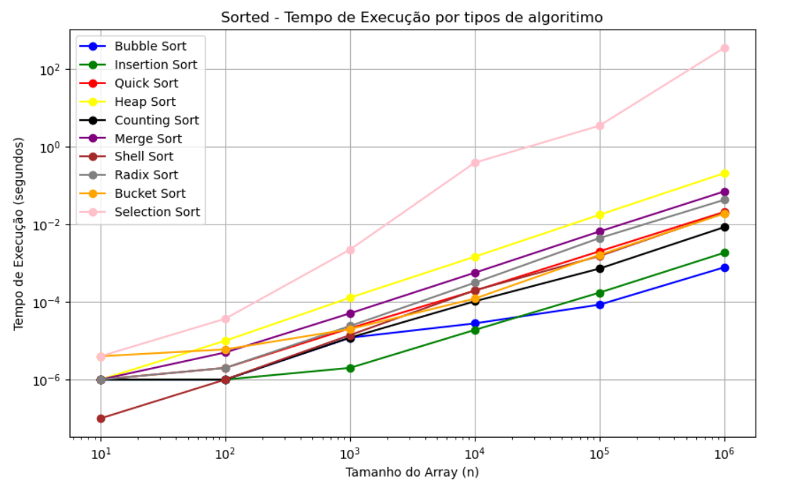
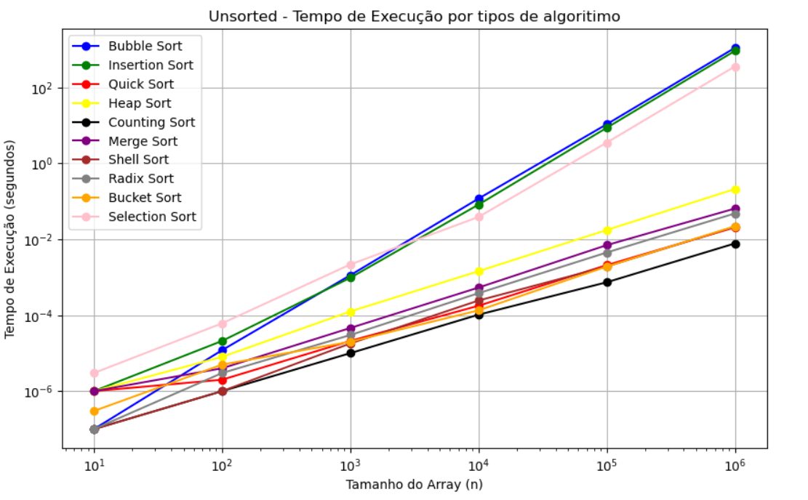
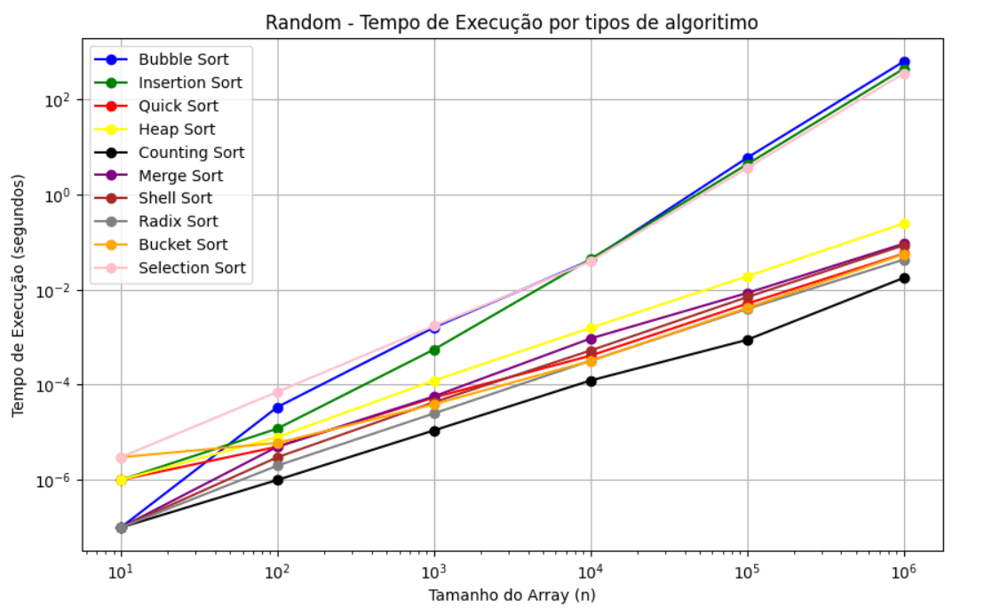

:construction: under construction :construction:   
this project was made w/ my friend <a href="https://github.com/brenobernal40"><strong>breno bernal</strong></a> !!

# sort algorithms analysis
this repo contains the main sort algorithms implemented in C
beyond that, it has a algorithm complexity analysis (w/ some graphs to help the visualization)
it was a project of Algorithm Analysis =)

## which algorithms were implemented?
<ul>
  <li>bubble</li>
  <li>insertion</li>
  <li>selection</li>
  <li>shell</li>
  <li>merge</li>
  <li>quick</li>
  <li>heap</li>
  <li>counting</li>
  <li>radix</li>
  <li>bucket</li>
</ul>
  
## graphs

